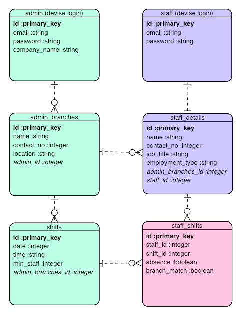
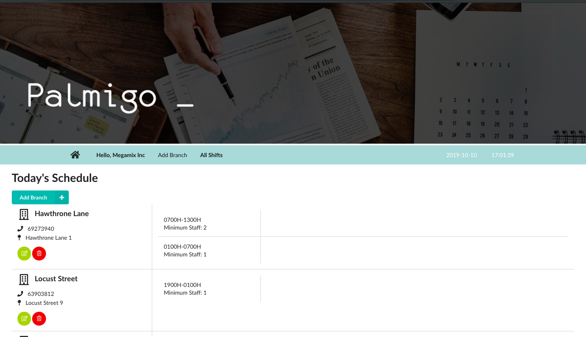
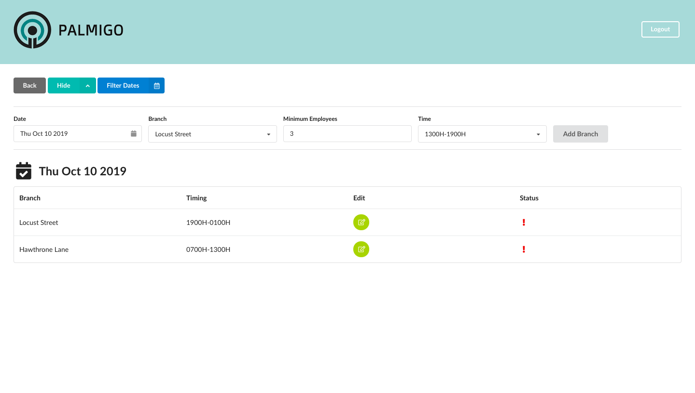
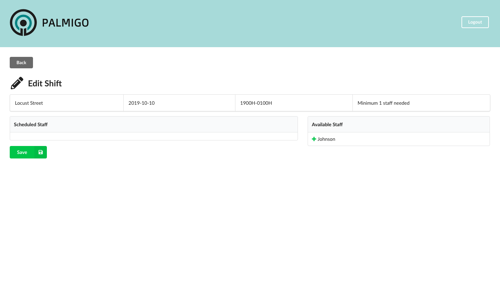
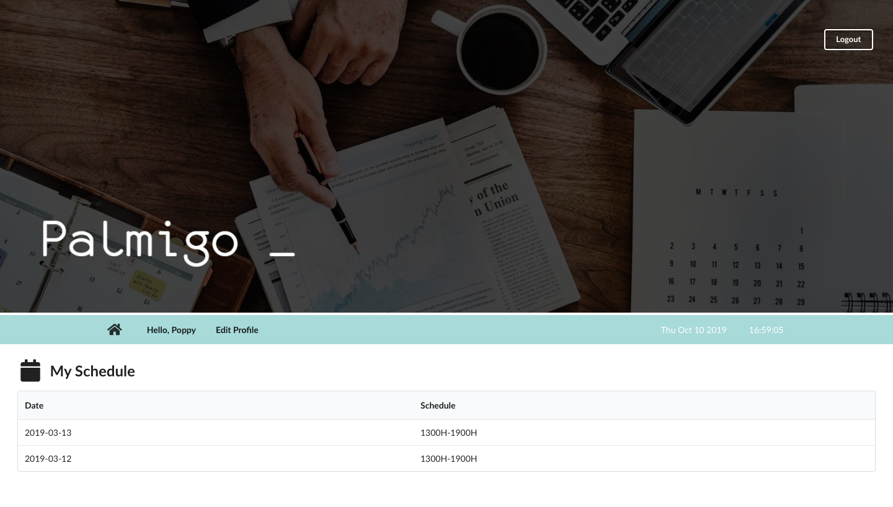
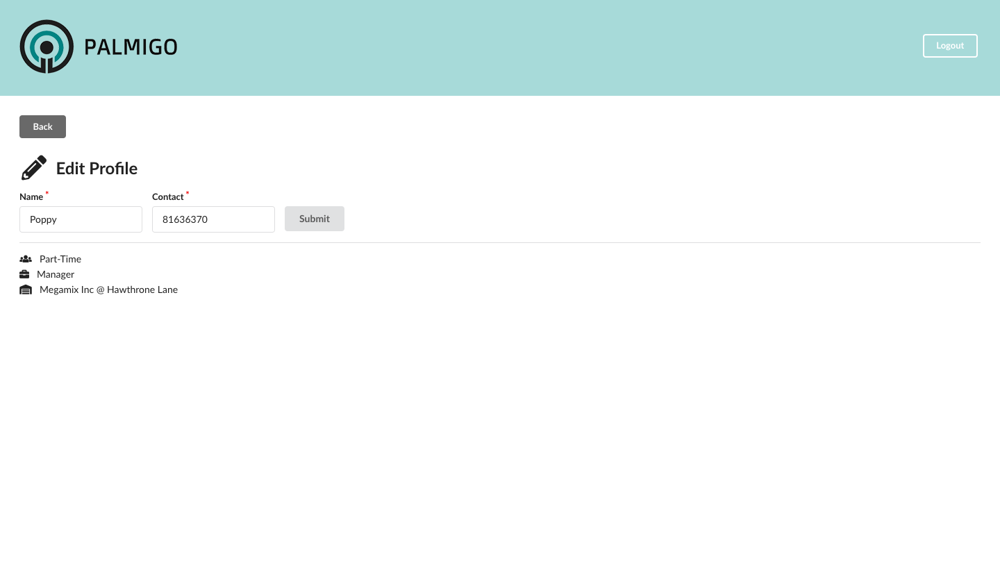

# Palmigo

- A HR management portal with both administrator and staff platform.
- Manage multiple outlets and their respective shifts and working staff at a glance.
- A full stack app built on React.js, Ruby on Rails, and PostgreSQL.

## Database Design

This is the ERD that is designed to visualise the relations between the different entities. *(Admin here refers to the companies or departments managing the group of staff)*

- **admin** & **staff** -  Admin and staff have their respective login information.
- **admin_branches** - Each admin has many company outlets and each of these outlets can have many staff.
- **staff_details** - Each staff belongs to one company outlet, and can have multiple shifts.
- **shifts** - Each shift belongs to a company outlet.
- **staff_shifts** - Each staff's shift is linked to a certain shift, staff and also indirectly the outlet. This will also show whether the staff is present or absent. 

## Features

### Homepage

### Admin Platform

Overview of shifts added of the current day

Overview of shifts and their statuses of selected day

Edit selected shift and assign staff that is working at the particular outlet

### Staff Platform

Overview of staff's assigned shifts

Edit staff information

## Technologies 

- ReactJS
- PSQL
- Ruby on Rails
